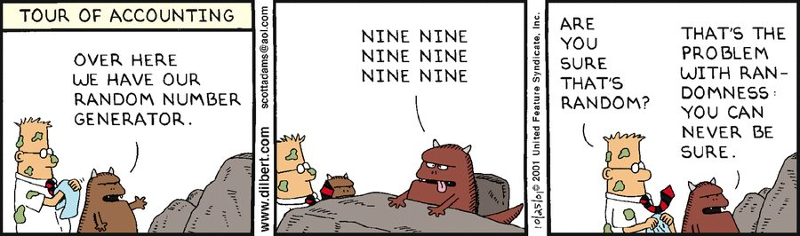
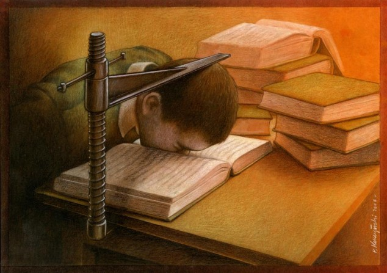
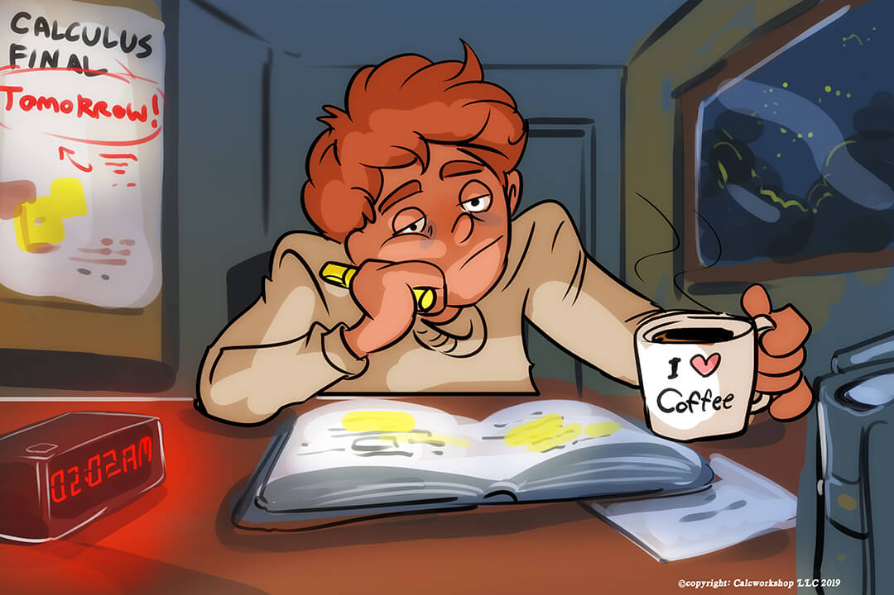
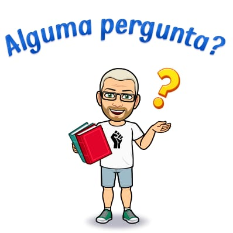
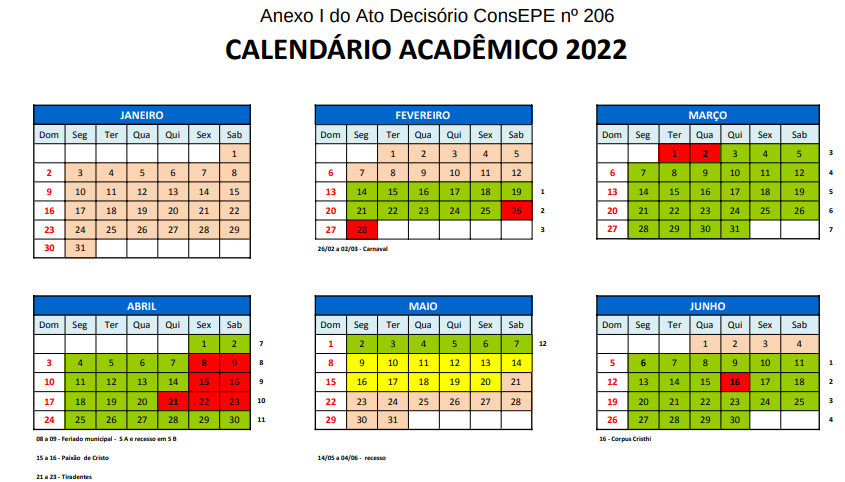

# Algoritmos Probabilísticos 2022 - 1

[**Jair Donadelli**](http://hostel.ufabc.edu.br/~jair.donadelli/)  — **email** jair.donadelli ‘arroba’ ufabc. …

Algoritmos aleatorizados nasceram  como uma ferramenta na teoria computacional dos números e evoluiram rapidamente para um conjunto de ferramentas e técnicas com ampla aplicação desde criptografia até a teoria da aprendizagem computacional. Esta disciplina apresenta os conceitos básicos de algoritmos aleatorizados em um nível acessível a alunos avançados no curso de graduação. A disciplina está organizada em três linhas principais: as ferramentas e técnicas probabilísticas, os fundamentos computacionais e áreas específicas de aplicação. **Pré-requisitos:** Introdução a Probabilidade e  Estatística; Análise de Algoritmos. 

Se está matriculado, atente para seu email institucional. [Esta disciplina está no moodle](https://moodle.ufabc.edu.br/course/view.php?id=2760)

[toc]

### **Ementa**

Ferramentas e Técnicas: Teoria básica da probabilidade;  Markov, Chebyshev e desigualdades de momento; problemas de coleção de cupons e ocupação ; desigualdades de cauda e limites de Chernoff; expectativa condicional e martingais; cadeias de Markov e passeios aleatórios. Fundamentos: teoria da complexidade probabilística; técnicas de teoria dos jogos; problemas de aproximação e contagem; amplificação de probabilidade e desaleatorização. Aplicações: classificação e busca; estruturas de dados; otimização combinatória e algoritmos de grafos; algoritmos para conjuntos de dados massivos, incluindo busca por similaridade, vizinhos mais próximos e agrupamento; algoritmos em teoria dos números.

### **Objetivos**

Possibilitar o aluno compreender os modelos probabilísticos de computação, seu poder e suas limitações, capacitar no uso desses modelos em problemas computacionais e no uso das ferramentas mais comuns da probabilidade para a análise de desempenho e limitação da probabilidade de erro.

### **Referências**

**Básicas**

1. Probablility and Computing, M. MITZENMACHER, E. UPFAL. 
2. Randomized Algorithms, R. MOTWANI e P. RAGHAVAN. 

**Complementares**

1. Computational Complexity: A Modern Approach, S. ARORA, B BARAK.
1. Design and Analysis of Randomized Algorithms, J. HROMKOVIC.
2. Concentration of measure for the analysis of randomized algorithms DUBHASHI e DEVSATT.

**Auto-ajuda**

R. Bianconi, [Como ler e estudar matemática?](http://www.ime.usp.br/~bianconi/recursos/mat.pdf)

Fernando Q. Gouvêa e Shai Simonson, [How to Read Mathematics](http://web.stonehill.edu/compsci/history_math/math-read.htm) (uma tradução “rápida e grosseira”, segundo o tradutor, [aqui](http://hostel.ufabc.edu.br/~daniel.miranda/?p=628)).

### **Avaliação**

      Provas

### **Atendimento**

   4ªs as 18h00, ou em horário agendado por email.

### **Programação**	 (em construção)

Oficialmente, as aulas são nas 3as as 10h00 e 5as 08h00. Na ultima oferta a programação  [está aqui](http://hostel.ufabc.edu.br/~jair.donadelli/disciplinas-ufabc/algprob20181.html).

| Semana |      | Tema                                                         | Atividade                                              |
| ------ | ---- | ------------------------------------------------------------ | ------------------------------------------------------ |
| 01     |      | Apresentação da disciplina. Dois exemplos: testes de identidade de produto de matrizes e polinômios. Desaleatorização. Revisão de análise de algoritmos. | Video aula Leitura de texto Discussão no Fórum |
| 02     |      | Revisão de espaços de probabilidade, probabilidade condicional e independência. Gerador de números aleatórios a partir de bits aleatórios. | Video aula Leitura de texto Discussão no Fórum |
| 03     |      | Variáveis aleatórias, esperança, distribuições geométrica e binomial, análise do *quicksort* probabilístico. | Video aula Leitura de texto Discussão no Fórum |
| 04     |      | Método probabilístico 1º momento; max-e3sat; , esperança condicional e desaleatorização. | Video aula Leitura de texto Discussão no Fórum |
| 05     |      | Método probabilístico 2º momento; problemas de ocupação; transição de fase. | Video aula Leitura de texto Discussão no Fórum |
| 06     |      | Modelos de computação, maquina turing probabilistica; classes de complexidade,  P, NP, BPP, P/poly. | Video aula Leitura de texto Discussão no Fórum |
| 07     |      | Criptografia; funções *one-way*; geradores pseudoaleatórios seguros;criptografia de chave pública. Provas com conhecimento zero. | Video aula Leitura de texto Discussão no Fórum |
| 08     |      | Avaliação                                                    |                                                        |
| 09     |      | Passeios aleatórios em grafos.                               |                                                        |
| 10     |      | Passeios aleatórios em grafos.                               |                                                        |
| 11     |      | leis de  desvios                                             |                                                        |
| 12     |      | leis de desvios                                              |                                                        |

#### Calendário acadêmico

