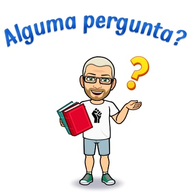

# Matemática Discreta 2022 - 1

**Professor** [Jair Donadelli](http://hostel.ufabc.edu.br/~jair.donadelli)   ---  **email**  jair.donadelli 'arroba' ufabc. ...

------

Matemática discreta (porém, exuberante) expõe ao aluno os princípios, técnicas e metodologias associadas a problemas em  estruturas matemáticas discretas, aquelas cujo domínio é enumerável, finito ou infinito. Em particular, nesta disciplina dá-se ênfase a princípios de indução, relações e princípios de contagem e combinatórios. 

Se está matriculado, atente para seu email institucional. [Esta disciplina está no moodle](https://moodle.ufabc.edu.br/course/view.php?id=2912). 

O horário oficial é 2a 8h00  e 5a 10h00; as aulas serão assíncronas.

------

**ÍNDICE:**

[toc]

### **Programação** **da disciplina**

**Conteúdo resumido**: Demonstrações. Teoria intuitiva de conjuntos. Relações e Funções. Indução. Análise Combinatória. Funções geradoras. Relações recorrência

[Notas de aula](http://bit.ly/2vmed2fdiscreta)

| Semana     | Tema                           | Subtemas                                                     | Atividades Teórico/Práticas |
| :--------: | ------------------------------ | ------------------------------------------------------------ | ------------------------------------------------------------ |
|   01   | Fundamentos            | Proposicões, valor-logico, conectivos logicos, equivalência logica, implicação lógica. Variáveis, predicados, quantificadores. Conjunto, pertinência, inclusão, operações e suas propriedades, conjunto das partes. Conjuntos numéricos: naturais, inteiros, suas propriedades aritméticas e de ordem. | - leitura de [texto](SEMANA1.pdf) - resolução de exercícios - discussão no fórum da semana |
|   02   | Demonstração | Prova direta, pela contrapositiva, por vacuidade, por contradição, por casos, equivalências, construtivas X existenciais. | - leitura de [texto](SEMANA2.pdf) - resolução de exercícios - discussão no fórum da semana |
|   03   | Indução                | As várias formas do princípio de Indução: indução, indução completa, indução para subconjuntos de inteiros limitados inferiormente, indução passo k, indução com passo pra trás. Equivalência entre princípios. Demonstrações usando indução. Definições recursivas de sequências e de conjuntos. | - leitura de [texto](SEMANA3.pdf) - resolução de exercícios - discussão no fórum da semana |
| 04 |                        | Avaliação | - resolução de exercícios  |
|   05   | Relação | Relações binárias eas classificações. Relações de ordem. Ordens parciais, totais e boa ordem. Grafos. | - leitura de [texto](SEMANA4.pdf) - resolução de exercícios - discussão no fórum da semana |
|   06   | Indução estrutural | Indução em conjuntos bem ordenados. Relações bem fundadas e indução bem fundada. | - leitura de [texto](SEMANA6.pdf) - resolução de exercícios - discussão no fórum da semana |
|   07   | Contagem | Bijeções, cardinalidade, conjuntos finitos, enumeráveis e infinitos. Princípio das gavetas (ou casa dos pombos). Princípios aditivo e multiplicativo. | - leitura de [texto](SEMANA7.pdf) - resolução de exercícios - discussão no fórum da semana |
|   08   | Avaliação | Avaliação | - resolução de exercícios  |
|   09   | Combinatória | Combinação, arranjo, permutação. Solução inteira de equações. Inclusão--exclusão; binômio de Newton; coeficiente multinomial; relações de equivalência, classe de equivalência e contagem. | - leitura de [texto](SEMANA9.pdf) - resolução de exercícios - discussão no fórum da semana |
|   10   | Funções geradoras | Funções geradoras e resolução de recorrências. | - leitura de [texto](SEMANA10.pdf) - resolução de exercícios - discussão no fórum da semana |
|   11   | Funções geradoras              | Funções geradoras e resolução de recorrências.               | - leitura de texto - resolução de exercícios - discussão no fórum da semana |
|   12   | Avaliação | Avaliação |  |
|  Rec   | Avaliação recuperativa |                                                              |  |

### **Ementa**

Teoria intuitiva dos conjuntos. Operações com conjuntos. Álgebra de conjuntos. Relações: relações de equivalência, relações de ordem. Funções. Coleções de Conjuntos. Conjuntos Numéricos. Cardinalidade. Técnicas de demonstração: prova direta, prova por contradição. Indução Finita. Introdução à Análise Combinatória. Princípio multiplicativo. Princípio aditivo. Permutação, arranjo, combinação. Princípio de inclusão e exclusão. O princípio da casa dos pombos. Funções geradoras. Partição de um inteiro. Relações de recorrência.

### **Objetivos** 

Esta disciplina tem como objetivos gerais permitir ao aluno dominar princípios, técnicas e metodologias associadas às estruturas discretas. 

### **Referências bibliográficas**

**Bibliografia básica**

   - ROSEN, Kenneth H. *Matemática discreta e suas aplicações*. 6ªEdição **[[510 ROSEma6\] ](http://biblioteca.ufabc.edu.br/index.php?codigo_sophia=13171).**
   - GRIMALDI, Ralph P., *Discrete and combinatorial mathematics : an applied introduction*. **[[510 GRIMdi5\] ](http://biblioteca.ufabc.edu.br/index.php?codigo_sophia=8910)**

 **Bibliografia complementar**

 1.  Matosek, J. e Nesetril, J.I. *An Invitation to Discrete Mathematics* **[510 MATOin2]**
   2. Velleman, Daniel J *How to prove it : a structured approach* 2. ed. **[511.3 VELh2]**
   3. Mitchel T. Keller e William T. Trotter *Applied Combinatorics* **[[aqui](https://people.math.gatech.edu/~trotter/book.pdf)]**
   4. Halmos, Paul R. *Teoria ingênua dos conjuntos* **[[511.322HALt\]](http://biblioteca.ufabc.edu.br/index.php?codigo_sophia=2439)**
   5. Ronald L Graham; Donald E Knuth; Oren Patashnik.*Matemática concreta* 2. ed. **[510 GRAHma2]**

------

**Auto-ajuda**
R. Bianconi, [Como ler e estudar matemática?](http://www.ime.usp.br/~bianconi/recursos/mat.pdf) 

Fernando Q. Gouvêa e Shai Simonson, [How to Read Mathematics](http://web.stonehill.edu/compsci/history_math/math-read.htm) (uma tradução "rápida e grosseira", segundo o tradutor, [aqui](http://hostel.ufabc.edu.br/~daniel.miranda/?p=628)).

------

### **Atendimento**

 O atendimento pelo professor se dará por meio eletrônicos. 

Todos são encorajados, e serão avaliados por isso segundo critérios abaixo e  sempre que  beneficie o coletivo, a submeter nos fóruns  do AVA suas dúvidas/respostas/soluções/encaminhamentos. Devem ser observados os princípios básicos de coordialidade e respeito com os colegas. Casos pessoais/particulares devem ser encaminhados por email. 

O atendimento semanal presencial se dá na 5as  as 10hs no link disponível no [moodle]().

------

### **Avaliação e Frequência**

Não haverá avaliação síncrona. 

É esperado uma conduta ética por parte do aluno. 

[Aqui](http://professor.ufabc.edu.br/~e.francesquini/codigodehonra/) e [aqui](https://www.ime.usp.br/~coelho/mac0323-2018/plagio.html) se tem uma boa referência do que é esperado. 

**Qualquer indício de fraude em qualquer atividade avaliativa implica na reprovação do aluno** e, eventualmente, encaminhamento docado  para a [comissão disciplinar](https://prograd.ufabc.edu.br/comissao-disciplinar-discente).

Lembrando que a UFABC tem um [código de ética](https://www.ufabc.edu.br/images/stories/comunicacao/Boletim/consuni_ato_decisorio_157_anexo.pdf) que apregoa:  Art. 25. Quanto aos trabalhos acadêmicos, é eticamente inaceitável que os discentes: I - fraudem avaliações; II -  fabriquem ou falsifiquem dados; III - plageiem ou não creditem devidamente autoria; IV - aceitem autoria  de material academico sem participação na produção;  24 V - vendam ou cedam autoria de material acadêmico próprio a pessoas que não participaram da produção.  

As **provas** serão 3, nas semanas indicadas na programação. São avaliações individuais. 

Os critérios de avaliação incluem

1.  Apresentação clara, legível, discursiva, uniforme e objetiva.
2.  Construção correta e em ordem dos argumentos.
3.  Atendimento às normas de correção ortográfica e gramatical.
4.  Observância às orientações específicas da atividade e aos prazos de entrega. 

*<u>Todo encaminhamento de atividade deve ser feito pelo moodle.*</u>

As **participações** nos fóruns são avaliadas de acordo  com

|                          | critério                                                     | pontos   |
| ------------------------ | ------------------------------------------------------------ | -------- |
| Não participa            | Não participa dos fóruns                                     | -10      |
| Participação reativa     | Participa esporadicamente sem aprofundamento, coerência teórica,  sem autoria, sem trocas de ideias e diálogos, não traz questões para o debate, não compartilha material. | 0        |
| Participação  interativa | O aluno participa dos fóruns *com regularidade*, aprofundamento, coerência, autoria, diálogo como os pares (coautoria), traz questões para o debate e compartilha material com os pares. | até $10$ |

(a participação deve ser ao longo do quadrimestre, não se dê ao trabalho de encher/"flodar" os fóruns nas últimas semanas/dias)

**Nota e Conceito final**:    serão avaliados com nota 0 a 100 nas atividades;

**Nota** = 80%$\cdot$(média das provas) + 20%$\cdot$(média dos questionários)  + Participação

| Nota                   | Conceito final |
| ---------------------- | -------------- |
| 85 $<$ Nota $\leq$ 100 | A              |
| 65 $<$ Nota $\leq$  85 | B              |
| 50 $<$ Nota $\leq$ 65  | C              |
| 45 $<$ Nota $\leq$ 50  | D              |
| 0 $<$ Nota $\leq$ 45   | F              |

#### **Frequência**

Toda semana haverá atividade que deverá ser entregue. Essa atividade conta para a avaliação e conta para a  frequência. A frequência é considerada para efeito nas regras da avaliação recuperativa.

#### **Recuperação**

Tem direito a recuperação aqueles que foram aprovado com D ou reprovado com F e *obtiveram frequência mínima*. A nota da recuperação é a média aritmética simples da notas do período regular e da avaliação recuperativa. Essa média será convertida para conceito de acordo com a tabela acima. 

A data da prova será combinada ao final do quadrimestre.

### **Links**

1. [Plataformas digitais](https://docs.google.com/document/d/1St2GniLrGAuDBJgnb1oFfAlJiLwAJPucC3t0c_Vbza4/edit), Biblioteca UFABC
2. Material antigo: [Provas](ProvasAntigas), [listas](ListasAntigas), [slides](SlidesAntigos), [Notas de aulas](NotasAulaAntigas)
3. Outras ofertas dessa disciplina: [[2002/2](disciplinas-ufpr/discreta1.html)], [[2003/1-A](disciplinas-ufpr/discreta2A.html)], [[2003/1-B](disciplinas-ufpr/discreta2B.html)], [[2003/2](disciplinas-ufpr/discreta3.html)], [[2004/1](disciplinas-ufpr/discreta4AB.html)], [[2008/1](disciplinas-ufpr/discreta5.html)], [[2008/2](disciplinas-ufpr/discreta6.html)], [[2009/1](disciplinas-ufpr/md.html)], [[2009/1](disciplinas-ufpr/md.html)], [[2015/1](disciplinas-ufabc/md20151.html)], [[2017/1](disciplinas-ufabc/md20171.html)], [[2018/1](disciplinas-ufabc/md20181.html)], [[2019/1](disciplinas-ufabc/md20191.html)] 
4. [Matemática discreta](https://en.wikipedia.org/wiki/Discrete_mathematics), entrada no wikipedia (em inglês, a página em português não está boa).
5. [Belos problemas de matemática](http://www.sbm.org.br/coloquio-sul-4/wp-content/uploads/sites/4/2016/04/Minicurso_Belos_Problemas.pdf)(sobre indução, contagem e casa dos pombos)
6. Lásló Lovász, [Discrete and Continuous: Two sides of the same?](http://www.cs.elte.hu/~lovasz/telaviv.pdf).
7. [Death by infinity puzzles and Axiom of Choice ](https://www.youtube.com/watch?v=aDOP0XynAzA)(video ~12min)
8. [a home page for the Axiom of Choice](http://math.vanderbilt.edu/schectex/ccc/choice.html)
9. (Video) [The Banach–Tarski Paradox](https://www.youtube.com/watch?v=s86-Z-CbaHA&t=58s)
10. *Foolproof: A Sampling of Mathematical Folk Humor* Paul Renteln and Alan Dundes. [[pdf](http://www.ams.org/notices/200501/fea-dundes.pdf)]
11. [On proof and progress in mathematics](https://arxiv.org/pdf/math/9404236v1.pdf) William Thurston
12. Sobre a representação decimal de reais ([em inglês](https://www.dcs.warwick.ac.uk/people/academic/Steve.Russ/cs131/NOTE18.PDF)).

------

### **[Calendário acadêmico](https://prograd.ufabc.edu.br/pdf/calendario_academico_2021.pdf)**

