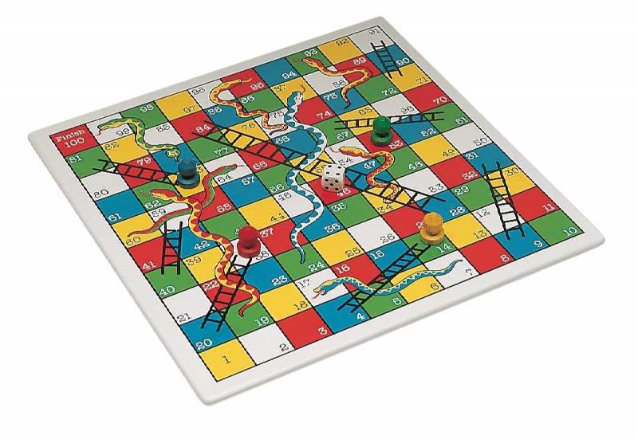

***

# Propostas de temas

Seguem algumas sugestões de temas para dissertação, caso se interesse por algum deles ou tenha alguma uma ideia e queira conversar sobre ela mande um *email*

## Jair Donadelli - jair.donadelli@ufabc.edu.br

[toc]

## 1 - <u>Probabilidade</u>

### 1.1 - Dados não transitivos


### 1.2 - Jogo das cobras e escadas (*Snakes and Ladders*)

Analisar o jogo de tabuleiro "[Cobras e escadas](http://www.playonlinedicegames.com/snakesandladders)" utilizando cadeias de Markov e usar de [programação de computador](https://colab.research.google.com/drive/12nWGTxsGxolnj_cvBuW5fPm6Ztp1kLUs?usp=sharing) para [simular](https://people.sc.fsu.edu/~jburkardt/py_src/snakes_and_ladders/snakes_and_ladders.html) simular o jogo com variantes das regras e do *layout* do tabuleiro.  

O tabuleiro padrão consiste em 100 quadrados dispostos em ordem numérica, de 1 a 100. Na vez de cada jogador, joga-se um dado e move-se um peão o número de quadrados sorteado. O primeiro jogador a chegar  ao quadrado 100 ganha o jogo. Se cair na base de uma escada, então sobe para o topo e se cair na boca de uma cobra desce até o rabo. 

Estudamos a evolução de um jogador a partir de uma [cadeia de Markov absorvente](https://pt.wikipedia.org/wiki/Cadeias_de_Markov#Absorvendo_estados) dada por  um vetor $\mathbf{v}_t = \pmatrix{p_i(t)}_{i=1}^{100}$ onde $p_i(t)$ é a probabilidade com que o jogador está no quadrado $i$ após o $t$-ésimo lançamento de dado, e por uma matriz $\mathbf{A}$ com as probabilidades de transição entre as casas do tabuleiro, assim  $\mathbf{v}_{t+1} = \mathbf{A} \mathbf{v}_t$.

O jogo tem muitas questões interessantes do ponto de vista de probabilidades, desde mais simples até mais sofisticadas: qual a probabilidade de estar num quadrado ímpar na 1ª rodada? na 2ª? Em média, quantas rodadas dura o jogo? Com que  frequência você encontra uma cobra? É melhor ter escadas mais longas ou cobras mais curtas?  Qual é a  chance de alcançar o fim após, digamos, 30 rodadas? Com 2 jogadores, qual a vantagem de quem começa? 

- Assumindo um dado com $n$ faces equiprováveis, qual valor de $n$ resulta no menor número esperado de rodadas para um jogador terminar o jogo?
- Fazendo o jogador retornar ao começo quando chega na casa 100 (o jogo nunca termina) o que acontece com $\mathbf{v}_t$ quado $t\to \infty$? converge para uma [distribuição estacionária](https://pt.wikipedia.org/wiki/Cadeias_de_Markov#An%C3%A1lise_de_estado_estacion%C3%A1rio_e_distribui%C3%A7%C3%B5es_limitantes)?

### 1.3 - Embaralhamento

*Quantas vezes é necessário embaralhar um baralho de cartas até que fique aleatório*? 

A proposta para este tema é estudar uma análise que usa como ferramentas combinatória e probabilidade e que garante que *<u>**doze** embaralhamentos são suficientes</u>*.

Uma resposta depende de (1) quantas cartas; (2) como embaralhamos e (3) como  se mede o “aleatório”. Usamos um baralho tradicional de 52 cartas e embaralhamos do modo "tradicional" dividindo a pilha ao meio e intercalando as metades. Esse método é chamado de [*modelo GSR*](https://en.wikipedia.org/wiki/Gilbert%E2%80%93Shannon%E2%80%93Reeds_model) (de Gilbert, Shannon e Reeds) que é o modelo mais usado na literatura sobre embaralhamento de cartas porque vem de uma noção intuitiva de como o  embaralhamento é feito na prática. O embaralhamento pode ser modelado como uma cadeia de Markov. Os estados são permutações do baralho de cartas (são $52! = 8 \times 10^{67}$ estados) e as probabilidades de transição de um estado para outro são dadas pelo modelo GRS.  

A teoria nos diz que embaralhando "infinitamente" teremos, no limite, a distribuição uniforme nos estados, i.e., o resultado é qualquer permutação com probabilidade 1/52!.  O  [tempo de mistura](https://en.wikipedia.org/wiki/Markov_chain_mixing_time)  ("mixing time") de uma cadeia de Markov é o número de etapas necessárias para que essa convergência aconteça, com um grau adequado de precisão. 

A resposta que demos acima, tema desta proposta, é uma versão mais simples de um resultado que ficou bastante conhecido (deu no [New York Times](https://www.nytimes.com/1990/01/09/science/in-shuffling-cards-7-is-winning-number.html), como diria um cantor). Em 1992, os matemáticos P. Diaconis (que também é mágico) e D. Bayer [publicaram](https://statweb.stanford.edu/~cgates/PERSI/papers/bayer92.pdf): *<u>no modelo GSR  **sete** embaralhamentos são suficientes</u>*. 

### 1.4 - Modelo para um esquema de pirâmide

Desenvolver um modelo probabilístico para um esquema de pirâmide financeira que oferece para as pessoas recompensas por um trabalho de revenda e por recrutamento de novos vendedores. Esse modelo permite calcular, por exemplo, que  
- em média, 1/2 dos participantes não recrutará ninguém e perderá todo o seu dinheiro;
-  em média, no máximo 1/8 dos participantes recrutará três ou mais pessoas.

Esse modelo envolve estimativas para a distribuição de uma [variável aleatória](https://pt.wikipedia.org/wiki/Vari%C3%A1vel_aleat%C3%B3ria#Vari%C3%A1vel_aleat%C3%B3ria_discreta) [binomial](https://pt.wikipedia.org/wiki/Distribui%C3%A7%C3%A3o_binomial) a partir da [distribuição Poisson](https://pt.wikipedia.org/wiki/Distribui%C3%A7%C3%A3o_de_Poisson).

### 1.5 - Teoria dos números

Mostrar com alguns exemplos de como probabilidade pode ser usada como ferramenta em teoria dos números como para demonstrar que 

1. *quase todo inteiro tem aproximadamente $\log(\log(n))$ fatores primos,*
2. *há uma infinidade de números primos*.

O primeiro resultado ([teorema de Hardy--Ramanujan](https://en.wikipedia.org/wiki/Hardy%E2%80%93Ramanujan_theorem), 1917) tem um prova complicada sem usar probabilidade e um prova devida a [Turán](https://pt.wikipedia.org/wiki/P%C3%A1l_Tur%C3%A1n) (1934) usando ferramentas simples de probabilidade, a [desigualdade de Chebyshev](https://en.wikipedia.org/wiki/Chebyshev%27s_inequality#Probabilistic_statement). O segundo resultado, o teorema de Euclides,  tem muitas [demonstrações diferentes](https://primes.utm.edu/notes/proofs/infinite/); uma delas decorre de uma prova probabilística (elementar) do [produto de Euler](https://en.wikipedia.org/wiki/Proof_of_the_Euler_product_formula_for_the_Riemann_zeta_function) para a função zeta
$$
\sum_{n=1}^{\infty} {n^{-s}}
= \prod_{p \text{ primo}} (1-p^{-s})^{-1}
$$

e outra demonstração é uma aplicação da [regra do produto](https://pt.khanacademy.org/math/ap-statistics/probability-ap/probability-multiplication-rule/a/general-multiplication-rule) para medida de probabilidade para variáveis aleatórias escolhidas de um modo apropriado.

***

## 2 - <u>Combinatória e Teoria dos Grafos</u>

### 2.1 - Arbitragem no mercado de câmbio

Digamos que 1 dólar compra 0,82 euros, 1 euro compra 129,7 ienes, 1 iene compra 0,096 dólares. Então, ao converter moedas USD$\to$EUR$\to$JPY$\to$USD começamos com 1 dolar e terminamos com 1,02 dólares obtendo um lucro de 2%. 

A **arbitragem** ocorre quando um ativo é comprado em um mercado onde está mais barato e vendido onde está mais caro. Com a informatização do mercado, estão cada vez menos frequentes as oportunidades de arbitragem. Estas distorções de preços tendem a durar poucos segundos, portanto as operações devem ser automatizadas e devem agir rapidamente. 

A ideia é propor uma solução baseada num algoritmo em  [teoria dos grafos](https://pt.wikipedia.org/wiki/Teoria_dos_grafos)

```
para todo vertice
        λ[vertice] ← ∞
        π[vertice] ← nulo
    λ[inicial] ← 0
    para i de 1 até |V| -1
        para toda aresta (u,v) 
            se λ[v] > λ[u] + pesos(u,v) 
               λ[v] ← λ[u] + pesos(u,v)
               π[v] ← u
```

conhecido como  [algoritmo de Bellman--Ford](https://pt.wikipedia.org/wiki/Algoritmo_de_Bellman-Ford) para o problema dos [caminhos mínimos](https://pt.wikipedia.org/wiki/Problema_do_caminho_m%C3%ADnimo). 

### 2.2 - Agendamento em esportes 

Agendar jogos para toda a temporada de uma liga envolve cumprir muitas restrições para gerar datas  e horários que otimizem as questões logísticas e que sejam vistos como justos para todos os que têm  interesse (fãs, jogadores, cartolas e emissoras). São exemplos de restrições ter o mesmo número de jogos  em casa e fora, não ter muitos dias consecutivos de folga ou de jogo, horários  são economicamente  vantajosos,  reduzir a distância total de viagens, da logística da cadeia de suprimentos e as designações de voos de avião. 

Há muitos modelos baseados em matemática discreta onde técnicas combinatórias, da [teoria dos grafos](https://pt.wikipedia.org/wiki/Teoria_dos_grafos), da álgebra linear e da [programação inteira](https://pt.wikipedia.org/wiki/Programa%C3%A7%C3%A3o_inteira) são aplicados à otimização de agendamento e que resultam em benefícios econômicos e  ambientais.

### 2.3 - Coloração, Sudoku e polinômios

[Colorir propriamente um grafo](https://pt.wikipedia.org/wiki/Colora%C3%A7%C3%A3o_de_grafos) significa atribuir cores a seus vértices de modo que vértices adjacentes não recebam a mesma cor. Do ponto de vista computacional, descobrir o número mínimo de cores é [muito difícil](https://pt.wikipedia.org/wiki/NP-completo); descobrir se um grafo é 3 colorível já é (computacionalmente) difícil, essencialmente exige força-bruta. Colorir um grafo é  equivalente a resolver um [Sudoku](https://pt.wikipedia.org/wiki/Sudoku) que é equivalente a um sistema de equações polinomiais ter solução.

<!--
SUuji wa DOkushin ni KagirU (os dígitos devem permanecer unicos)
-->

Aqui há duas propostas relacionadas a tais equivalências:

1. Um protocolo de [prova de conhecimento zero](https://pt.wikipedia.org/wiki/Provas_de_conhecimento-zero) para o Sudoku, ou seja,  um protocolo de interação entre duas partes, o *provador* e o  *verificador*, que permite ao provador convencer o verificador de que ele resolveu um quebra-cabeça de Sudoku, porém <u>sem revelar a solução ao verificador</u>. A questão interessante  é como um provador pode mostrar: (i) que há uma solução e (ii) que ele conhece a solução, embora não forneça nenhuma informação sobre a solução para o verificador.
2. Estudar a teoria das [bases de Gröbner](https://pt.wikipedia.org/wiki/Base_de_Gr%C3%B6bner) e sua aplicação ao problema da coloração de grafos, usar a equivalência para uma abordagem de carater lúdico traduzindo o Sudoku em um problema de coloração e resolvê-lo com o método algébrico.

### 2.4 - Modelagem das relações comerciais no mundo
<!-- 
No grafo ao lado temos 3 países e 5 produtos, com ela definimos uma  probabilidade de coexportação de um produto: medicamentos e raio-x tem probabilidade de coexportação 1, pois nessa rede todo pais que exporta um, exporta o outra; queijo e raio-x tem probabilidade 1/2 pois de dois países que exportam queijo, so um exporta raio x; peixe e medicamentos 1/3, pois de três países que exportam peixes, so um exporta raio x. O que essas probabilidades dizem? Que raio-x e medicamentos estão próximos em termos de capacidades existentes nos tecidos produtivos necessárias para produzi-los e que peixes e raio-x estão distantes em termos de capacidades necessárias para produção. Essa é uma ferramenta para  inferir as capacidades produtivas existentes em cada economia. 
-->
<!-- 
Hidalgo et al. (2007) calcularam probabilidades condicionais de exportação de cada par de produtos para   estabelecer conexões entre produtos. Segundo os autores, elevadas probabilidades de coexportação  indicariam que a produção dos dois bens requer capacidades semelhantes para serem produzidos. Estabelecendo um critério de corte para essas proximidades, os autores formaram então um grafo interligando os produtos, chamado *product space*, que possibilita visualizar como produtos que usam capacidades semelhantes tendem a se agrupar, enquanto pro dutos que usam capacidades distintas  tendem a se distanciar na rede. Os produtos do centro são feitos por países ricos, os da periferia por países pobres. -->

### 2.5 - Dados de Sicherman

*É possível numerar as faces de dois cubos com inteiros positivos de modo diferente dos dados tradicionais mas de modo que a distribuição da soma das faces tem a mesma distribuição dos dados tradicionais?*

*palavras-chave*: funções geradoras

#### <u>Comb. e Grafos $+$ Álgebra Linear:</u>

### 2.6 - O  do seu vizinho é maior que o seu...em média

O *grau de um vértice* num grafo é o número de arestas que incide nele. No grafo ao lado, com 8 vértices e  8 arestas, o maior grau é 4 (no vértice 1) e o menor é 1 (eg, no vértice 2). O grau médio é $\frac{16}8=2$. Vértices ligados por aresta são ditos *vizinhos*.  Os graus dos vizinhos dos vértices 1,2,...,8 são, respectivamente, (1,1,1,3), 4,4,4,(4,2,3),(3,3),(2,3,1),3 de modo que a média dos graus dos vizinhos é $\frac{42}{16}=2{,}625$, logo 

*o grau médio do vizinho é maior que o seu grau médio*

e isso vale para qualquer grafo como foi observado pela primeira vez pelo sociólogo Scott L. Feld em 1991; esse [fenômeno](https://pt.wikipedia.org/wiki/Paradoxo_das_amizades) atraiu muita atenção na literatura das ciências sociais onde passaram a estudar as propriedades que podem susbtituir 'grau médio' na sentença acima.

### 2.7 - Empacotamento de grafos completos

O seguinte problema originou-se num problema de redes de telecomunicação: queremos particionar o conjunto de arestas do [grafo completo](https://pt.wikipedia.org/wiki/Grafo_completo) de $n$ vértices, denotado $K^n$, de modo que cada parte seja o conjunto de arestas de um [grafo bipartido completo](https://pt.wikipedia.org/wiki/Grafo_bipartido_completo).

Por exemplo, o $K^6$ pode ser decomposto como


**Exercício** descubra uma decomposição do $K^n$ usando $n-1$ grafos bipartidos completos.

Dá pra usar menos?  Não!  A proposta é demonstrar esse resultado usando álgebra linear. 

### 2.8 - Ladrilhamento

Existem 12.988.816 ladrilhamentos do tabuleiro de xadrez 8 × 8 por peças de dominós. Ao lado está um deles.

Como todos eles podem ser contados? 

Esse tipo de contagem é considerada em várias áreas; matemáticos costumam falar sobre ladrilhamento, cientistas da computação sobre emparelhamentos perfeitos e físicos sobre o modelo do dímero (que é um modelo altamente simplificado, mas ainda assim interessante na física do estado sólido).

### 2.9 - Conjuntos de Kakeya em corpos finitos

Queremos rotacionar uma escada de 10m de comprimento dentro de um jardim (sem levantá-la).  Qual é a menor área de um jardim em que isso é possível? Por exemplo, ao lado temos um jardim que parece bastante econômico em termos de área. Esta questão é conhecida como [problema da agulha Kakeya](https://en.wikipedia.org/wiki/Kakeya_set). Um dos resultados bastante contra-intuitivos em matemática foi descoberto por Besicovitch (1920): há jardins de áreas arbitrariamente pequenas e que ainda permitem que a escada seja girada. Esse problema aparentemente recreativo leva à [conjectura de Kakeya](https://en.wikipedia.org/wiki/Kakeya_set#Statement) que é considerada uma questão matemática fundamental na análise harmônica ainda aparentemnte longe de ter solução.

Em 2009 um análogo da conjectura de Kakeya em corpos finitos foi resolvido por um argumento algébrico curto. Um conjunto $K$ no espaço vetorial $\mathbb{F}^n$ é um conjunto de Kakeya se contiver uma “reta” em todas as “direções” possíveis. 

A proposta é provar esse resultado que diz que qualquer conjunto de Kakeya em $\mathbb{F}^n$ tem pelo menos $\binom{|\mathbb{F}|+n-1}{n}$ elementos.

## 3 - <u>Indução</u>

O objetivo é escrever um texto sobre provas por indução, com muitos exemplos, que englobe várias formulações desse princípio, que esclareça a  ***<u>EQUIVALÊNCIA</u>*** entre eles e outros "princípios". Ainda, se possível, introduzir **ordens bem fundadas** e o princípio de indução que elas implicam.

Usualmente, o <u>PIF</u> é colocado como

- *para todo $S\subset \mathbb N$, se* 

  1. *$0\in S$*
  2.  *para todo $n$, $n\in S \Rightarrow n+1\in S$* 

   *então $S=\mathbb{N}$*

ou como 

- *para todo $S\subset \mathbb N$, se* 

  1. *$0\in S$*
  2.  *para todo $n$, $\{0,1,\dots,n\}\subset S \Rightarrow n+1\in S$* 

   *então $S=\mathbb{N}$.*

Menos conhecida é a seguinte sentença

- *para todo $S\subset \mathbb N$, se* 

  1. *$2^i\in S$ para todo $i\in \mathbb N$* 
  2.  *para todo $n$, $n+1 \in S \Rightarrow n\in S$* 

   *então $S=\mathbb{N}$*

que, eg, permite uma prova bacana por indução da *desigualdade das médias aritmética e geométrica*, mais simples que a prova usual por indução. Há ainda outras formulações e todas elas decorrem do 

*<u>Princípio da Boa Ordenação:</u> todo  $S\subset \mathbb{N}$ não vazio admite elemento mínimo*.

Num certo sentido, essas sentenças são ***<u>EQUIVALENTES</u>*** e equivalentes ao 

<u>*Princípio das Gavetas* (os *da Casa dos Pombos*)</u>: *Se $|A|>|B|>0$ então não há função injetiva $f:A\to B$.*

**Exercício** Deduza o PIF do princípio das gavetas.

*palavras-chave*: [relação de ordem](https://pt.wikipedia.org/wiki/Rela%C3%A7%C3%A3o_de_ordem), [relação bem fundada](https://pt.wikipedia.org/wiki/Rela%C3%A7%C3%A3o_bem-fundada), [indução estrutural](https://pt.wikipedia.org/wiki/Indu%C3%A7%C3%A3o_estrutural) (ou [noetheriana](https://en.wikipedia.org/wiki/Well-founded_relation)), [condição de cadeia descendente](https://en.wikipedia.org/wiki/Ascending_chain_condition#Definition), [teoria dos conjuntos de Zermelo-Fraenkel](https://pt.wikipedia.org/wiki/Axiomas_de_Zermelo-Fraenkel). 

## 4 - <u>Equações de recorrência</u> 